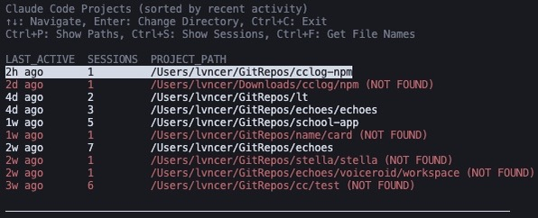

# cclog

TypeScript で実装された Claude Code 会話履歴ブラウザー

[](https://badge.fury.io/js/%40lvncer%2Fcclog)
[](https://opensource.org/licenses/MIT)

## 📖 概要

cclog は、Claude Code の会話履歴をコマンドライン上で効率的に閲覧・管理するためのツールです。インタラクティブなセレクターを使用して、過去のセッションを簡単に検索、閲覧、再開できます。

## ✨ 主な機能

- 🔍 **セッション一覧表示** - 現在のディレクトリの Claude Code セッションを一覧
- 📁 **プロジェクト一覧表示** - 全プロジェクトを最新活動順で表示
- 👀 **セッション内容表示** - 色分けされたメッセージ表示
- ℹ️ **セッション情報表示** - 詳細なセッション情報
- 🎯 **インタラクティブセレクター** - fzf 風の直感的な操作
- 🎨 **カラー出力** - 見やすい色分け表示
- 🔄 **セッション再開** - ワンクリックでセッションを再開

## 🚀 インストール

```bash
npm install -g @lvncer/cclog
```

## 📖 使い方

### 基本的な使い方

```bash
# セッション一覧を表示（現在のディレクトリ）
cclog

# プロジェクト一覧を表示
cclog projects

# セッション内容を表示
cclog view /path/to/session.jsonl

# セッション情報を表示
cclog info /path/to/session.jsonl

# ヘルプを表示
cclog help
```

### キーボード操作

#### ナビゲーション

- `↑↓` - 上下に移動
- `Enter` - 選択
- `Ctrl+C` - 終了
- 文字入力 - リアルタイム検索
- `Backspace` - 検索文字削除

#### セッション一覧での操作

- `Enter` - セッション ID を返す
- `Ctrl+V` - セッション内容を表示
- `Ctrl+P` - ファイルパスを返す
- `Ctrl+R` - セッションを再開（claude -r）

#### プロジェクト一覧での操作

- `Enter` - プロジェクトディレクトリに移動
- `Ctrl+P` - プロジェクトパスを返す
- `Ctrl+S` - プロジェクトのセッション一覧表示
- `Ctrl+F` - セッションファイル名一覧表示

## 🎯 使用例

### 1. セッション一覧から選択

```bash
cclog
```


### 2. セッションを再開

セッションを選択して `Ctrl+R` を押すと、そのセッションが Claude Code で再開されます。


### 3. プロジェクト間を移動

```sh
cclog projects
```



## 🔄 操作フロー

### メインフロー図


詳細な操作フローについては [docs/user-actions-flow.md](docs/user-actions-flow.md) をご覧ください。

## 🔧 開発者向け

### ローカル開発

```bash
# リポジトリをクローン
git clone <repository-url>
cd cclog

# 依存関係をインストール
npm install

# TypeScriptをコンパイル
npm run build

# 開発モードで実行（npm または bun）
npm run dev
bun run dev projects
```

### ファイル構成

```sh
src/
├── types/    # 型定義
├── core/     # コア機能
├── ui/       # UI機能
└── index.ts  # メインエントリー
```

## ⚠️ 注意事項

- **Claude Code** が `~/.claude/projects/` にデータを保存している必要があります
- **Node.js 14 以上** が必要です
- **Unix 系 OS**（macOS、Linux）で動作確認済み
- セッション再開機能には **`claude` CLI** がインストールされている必要があります

## 🤝 貢献

バグ報告や機能要望は [Issues](https://github.com/lvncer/cclog/issues) までお気軽にどうぞ。

## 📄 ライセンス

MIT License - 詳細は [LICENSE](LICENSE) ファイルをご覧ください。

## 🙏 クレジット

このプロジェクトは [@choplin](https://github.com/choplin) 氏の [cclog](https://github.com/choplin/cclog) を参考にしています。
