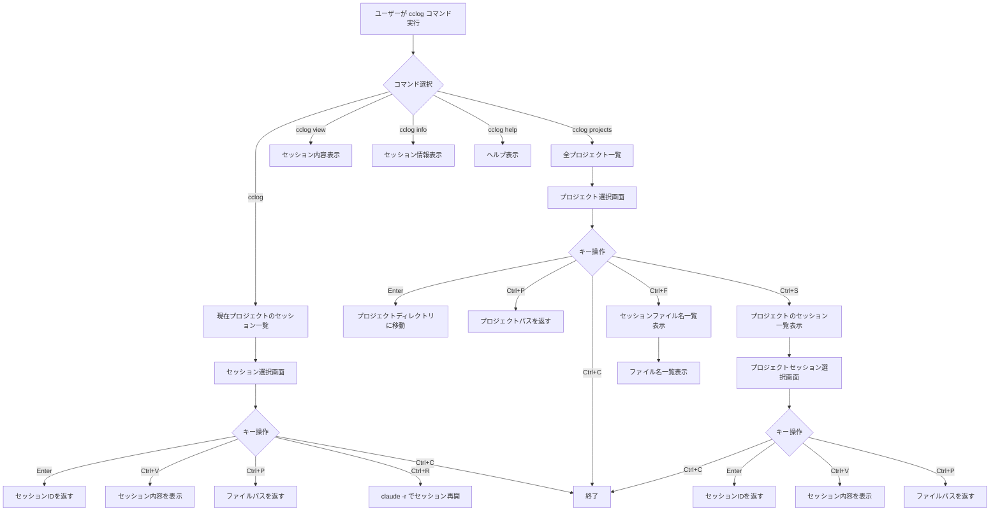
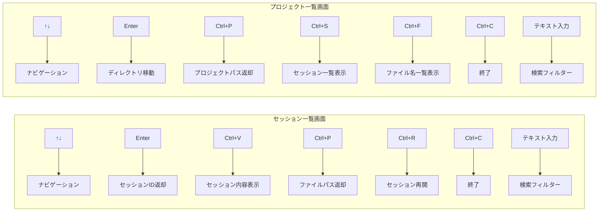
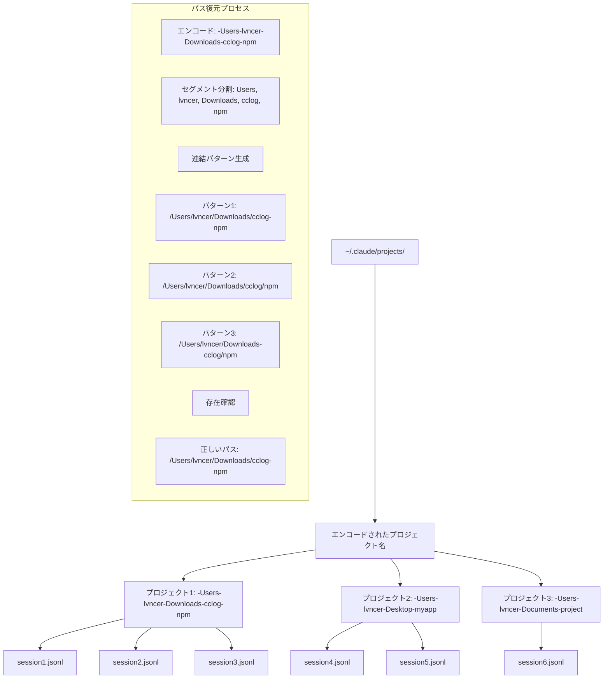
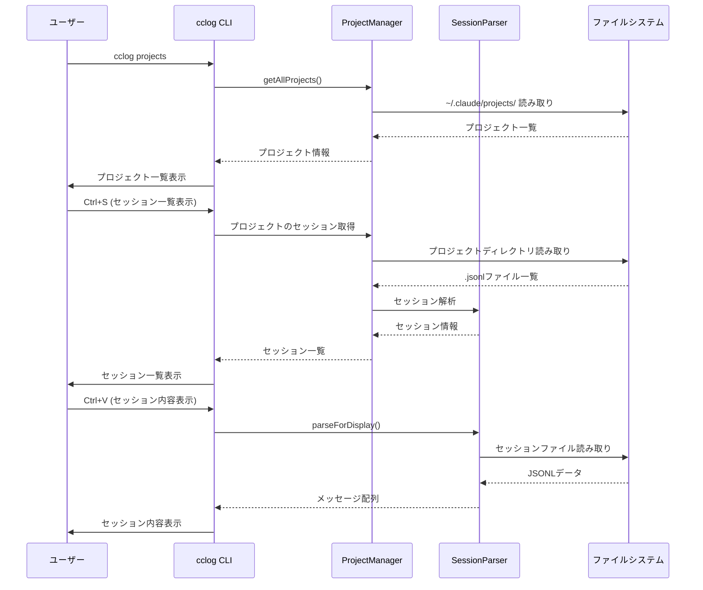
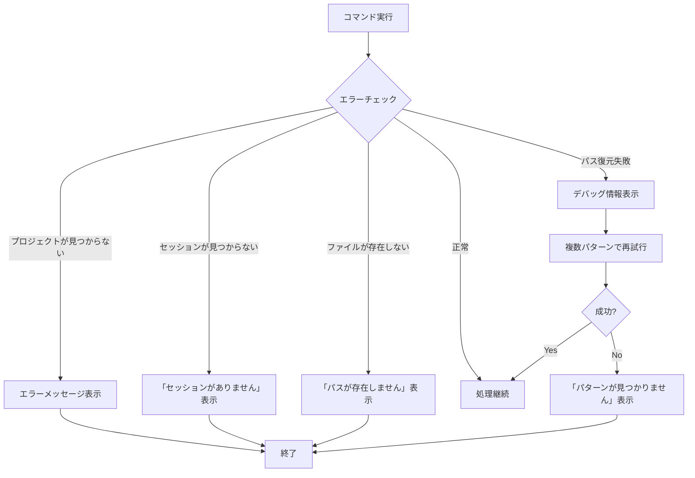
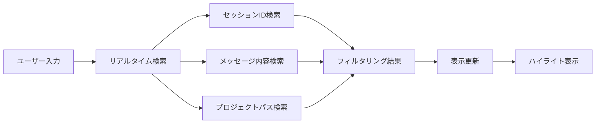
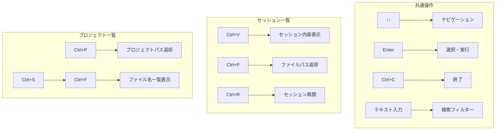

# cclog ユーザーアクション操作フロー

## メインフロー図

```mermaid
flowchart TD
    A[ユーザーが cclog コマンド実行] --> B{コマンド選択}

    B -->|cclog| C[現在プロジェクトのセッション一覧]
    B -->|cclog projects| D[全プロジェクト一覧]
    B -->|cclog view <file>| E[セッション内容表示]
    B -->|cclog info <file>| F[セッション情報表示]
    B -->|cclog help| G[ヘルプ表示]

    C --> H[セッション選択画面]
    D --> I[プロジェクト選択画面]

    H --> J{キー操作}
    I --> K{キー操作}

    J -->|Enter| L[セッションIDを返す]
    J -->|Ctrl+V| M[セッション内容を表示]
    J -->|Ctrl+P| N[ファイルパスを返す]
    J -->|Ctrl+R| O[claude -r でセッション再開]
    J -->|Ctrl+C| P[終了]

    K -->|Enter| Q[プロジェクトディレクトリに移動]
    K -->|Ctrl+P| R[プロジェクトパスを返す]
    K -->|Ctrl+S| S[プロジェクトのセッション一覧表示]
    K -->|Ctrl+F| T[セッションファイル名一覧表示]
    K -->|Ctrl+C| P

    S --> U[プロジェクトセッション選択画面]
    T --> V[ファイル名一覧表示]

    U --> W{キー操作}
    W -->|Enter| X[セッションIDを返す]
    W -->|Ctrl+V| Y[セッション内容を表示]
    W -->|Ctrl+P| Z[ファイルパスを返す]
    W -->|Ctrl+C| P
```

## キーバインド詳細図

```mermaid
graph LR
    subgraph "セッション一覧画面"
        A1[↑↓] --> A2[ナビゲーション]
        A3[Enter] --> A4[セッションID返却]
        A5[Ctrl+V] --> A6[セッション内容表示]
        A7[Ctrl+P] --> A8[ファイルパス返却]
        A9[Ctrl+R] --> A10[セッション再開]
        A11[Ctrl+C] --> A12[終了]
        A13[テキスト入力] --> A14[検索フィルター]
    end

    subgraph "プロジェクト一覧画面"
        B1[↑↓] --> B2[ナビゲーション]
        B3[Enter] --> B4[ディレクトリ移動]
        B5[Ctrl+P] --> B6[プロジェクトパス返却]
        B7[Ctrl+S] --> B8[セッション一覧表示]
        B9[Ctrl+F] --> B10[ファイル名一覧表示]
        B11[Ctrl+C] --> B12[終了]
        B13[テキスト入力] --> B14[検索フィルター]
    end
```

## ファイル構造とアクセスパス

```mermaid
graph TD
    A[~/.claude/projects/] --> B[エンコードされたプロジェクト名]
    B --> C[プロジェクト1: -Users-lvncer-Downloads-cclog-npm]
    B --> D[プロジェクト2: -Users-lvncer-Desktop-myapp]
    B --> E[プロジェクト3: -Users-lvncer-Documents-project]

    C --> F[session1.jsonl]
    C --> G[session2.jsonl]
    C --> H[session3.jsonl]

    D --> I[session4.jsonl]
    D --> J[session5.jsonl]

    E --> K[session6.jsonl]

    subgraph "パス復元プロセス"
        L[エンコード: -Users-lvncer-Downloads-cclog-npm]
        M[セグメント分割: Users, lvncer, Downloads, cclog, npm]
        N[連結パターン生成]
        O[パターン1: /Users/lvncer/Downloads/cclog-npm]
        P[パターン2: /Users/lvncer/Downloads/cclog/npm]
        Q[パターン3: /Users/lvncer/Downloads-cclog/npm]
        R[存在確認]
        S[正しいパス: /Users/lvncer/Downloads/cclog-npm]
    end
```

## ユーザー操作シーケンス

```mermaid
sequenceDiagram
    participant U as ユーザー
    participant C as cclog CLI
    participant PM as ProjectManager
    participant SP as SessionParser
    participant FS as ファイルシステム

    U->>C: cclog projects
    C->>PM: getAllProjects()
    PM->>FS: ~/.claude/projects/ 読み取り
    FS-->>PM: プロジェクト一覧
    PM-->>C: プロジェクト情報
    C->>U: プロジェクト一覧表示

    U->>C: Ctrl+S (セッション一覧表示)
    C->>PM: プロジェクトのセッション取得
    PM->>FS: プロジェクトディレクトリ読み取り
    FS-->>PM: .jsonlファイル一覧
    PM->>SP: セッション解析
    SP-->>PM: セッション情報
    PM-->>C: セッション一覧
    C->>U: セッション一覧表示

    U->>C: Ctrl+V (セッション内容表示)
    C->>SP: parseForDisplay()
    SP->>FS: セッションファイル読み取り
    FS-->>SP: JSONLデータ
    SP-->>C: メッセージ配列
    C->>U: セッション内容表示
```

## エラーハンドリングフロー

```mermaid
flowchart TD
    A[コマンド実行] --> B{エラーチェック}

    B -->|プロジェクトが見つからない| C[エラーメッセージ表示]
    B -->|セッションが見つからない| D[「セッションがありません」表示]
    B -->|ファイルが存在しない| E[「パスが存在しません」表示]
    B -->|パス復元失敗| F[デバッグ情報表示]
    B -->|正常| G[処理継続]

    C --> H[終了]
    D --> H
    E --> H
    F --> I[複数パターンで再試行]
    I --> J{成功?}
    J -->|Yes| G
    J -->|No| K[「パターンが見つかりません」表示]
    K --> H
```

## 検索・フィルター機能

```mermaid
graph LR
    A[ユーザー入力] --> B[リアルタイム検索]
    B --> C[セッションID検索]
    B --> D[メッセージ内容検索]
    B --> E[プロジェクトパス検索]

    C --> F[フィルタリング結果]
    D --> F
    E --> F

    F --> G[表示更新]
    G --> H[ハイライト表示]
```

## キーバインド一覧表

```mermaid
graph TD
    subgraph "共通操作"
        A1[↑↓] --> A2[ナビゲーション]
        A3[Enter] --> A4[選択・実行]
        A5[Ctrl+C] --> A6[終了]
        A7[テキスト入力] --> A8[検索フィルター]
    end

    subgraph "セッション一覧"
        B1[Ctrl+V] --> B2[セッション内容表示]
        B3[Ctrl+P] --> B4[ファイルパス返却]
        B5[Ctrl+R] --> B6[セッション再開]
    end

    subgraph "プロジェクト一覧"
        C1[Ctrl+P] --> C2[プロジェクトパス返却]
        C3[Ctrl+S] --> C4[セッション一覧表示]
        C4[Ctrl+F] --> C5[ファイル名一覧表示]
    end
```
